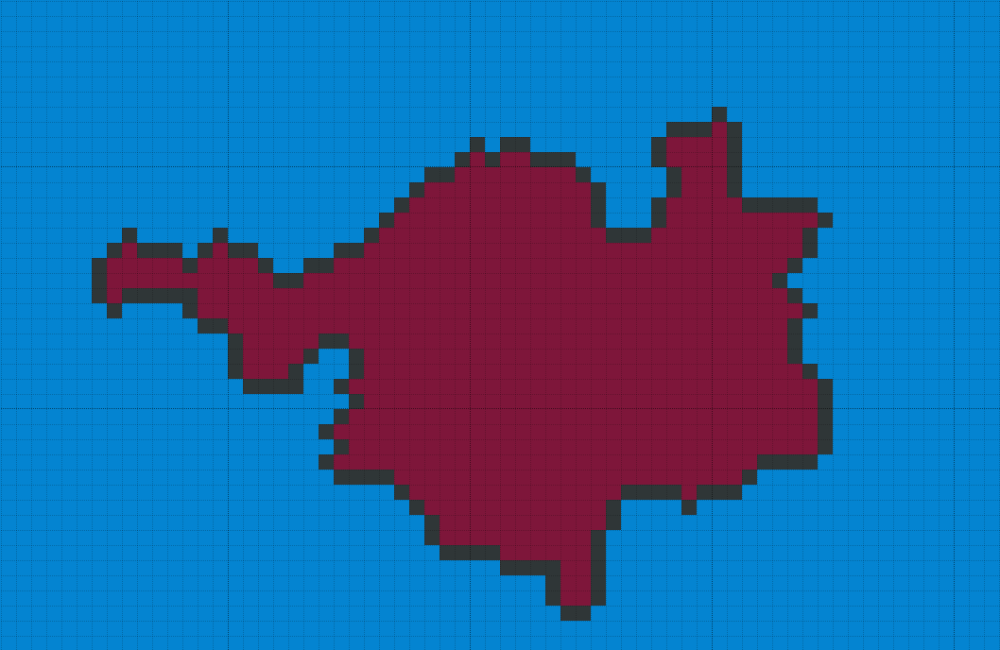

# How to play Strategy War

A game that is based on the <b>OWOP</b>, implies a global strategy in which the players themselves set goals for themselves.
 
Each player is given an initial territory in which to make decisions in order to achieve victory in the game. 
 
You have to capture territories to be the first in this game
